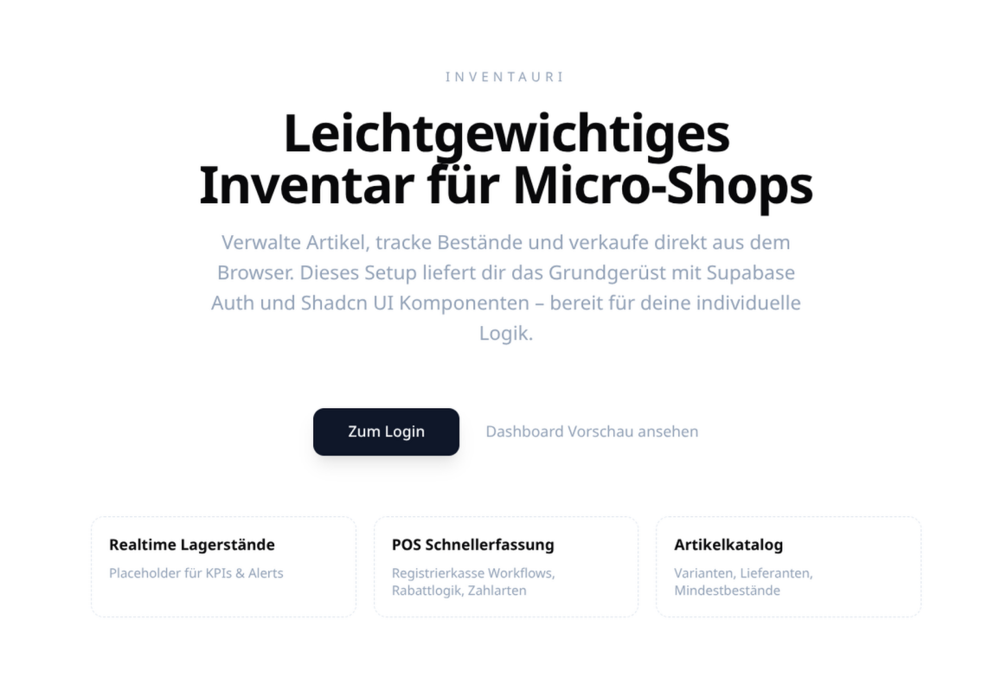
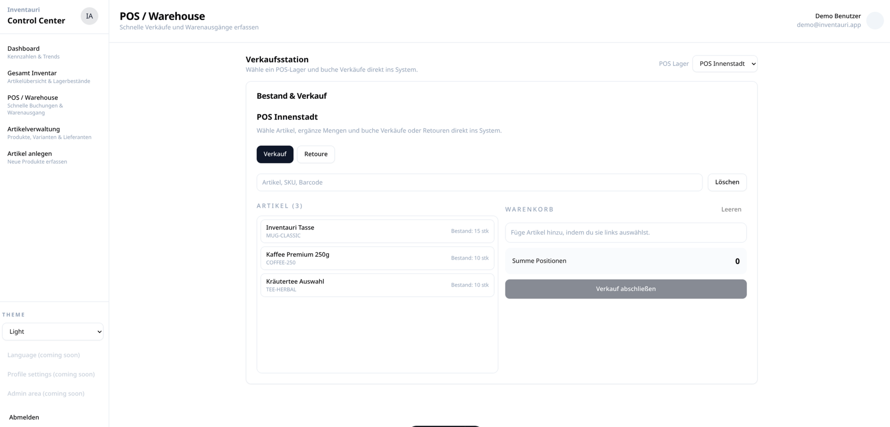
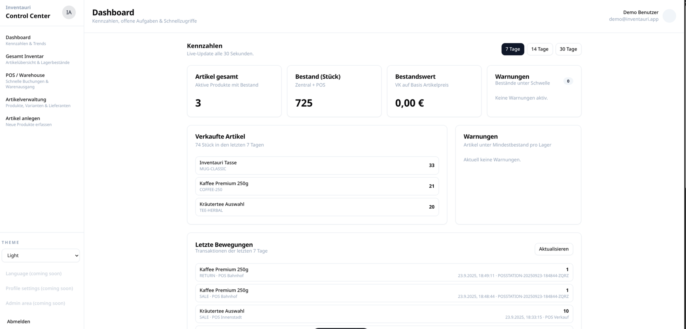

# ♉ Inventauri v2 – Astro + PocketBase + Shadcn UI + Prisma

## Specification

Inventauri v2 is a lightweight web-based inventory system for micro-shops, featuring:
- Item management
- Stock tracking
- Simple sales insights

**End project requirement:** The application must be executable via a Docker Compose file, enabling easy deployment and local development with all dependencies (app and database) managed as containers.



Inventauri v2 is a lightweight web-based inventory system for micro-shops, featuring item management, stock tracking and simple sales insights.

## 🔧 Quickstart

1. Configure environments:
   - `cp .env.example .env.local` → fill in PocketBase + Postgres values for local CLI development.
   - `cp .env.docker.example .env.docker` → tweak if you want custom passwords/ports for Docker Compose.

2. Install dependencies for local CLI workflows:
   ```bash
   npm install
   ```

3. (Native dev) Run Prisma migrations and seeds:
   ```bash
   npm run db:migrate
   npm run db:seed
   npm run dev
   ```
   Astro serves the app on [http://localhost:4321](http://localhost:4321) using your local PocketBase/Postgres instances.

4. (Docker stack) Build and launch the full environment (PocketBase + Postgres + Astro) via Compose:
   ```bash
   npm run docker:build
   npm run docker:up
   # CTRL+C or npm run docker:down to stop
   ```
   - PocketBase admin UI: [http://localhost:8090/_](http://localhost:8090/_)
   - Inventauri web app: [http://localhost:4321](http://localhost:4321)
   - Data persists inside the named volumes `inventauri_pg`, `inventauri_pb_data`, and `inventauri_pb_public`.

## 🗂️ Project Structure

```text
src/
├── components/
│   ├── auth/             # PocketBase login/logout helpers
│   ├── dashboard/        # Dashboard widgets & lists
│   ├── items/            # Item list & create form
│   ├── pos/              # POS terminal UI
│   └── ui/               # Shadcn-inspired React primitives
├── layouts/              # App shell
├── lib/
│   ├── api/              # Fetch helpers for authenticated routes
│   ├── auth/             # Cookie/session utilities
│   ├── data/             # Prisma data-access helpers (dashboard, items, POS, warehouses)
│   ├── services/         # Stock mutation services
│   ├── pocketbase-*      # PocketBase client + helpers
│   └── utils.ts
├── pages/
│   ├── api/              # JSON APIs (stock, items, dashboard)
│   ├── dashboard/
│   ├── inventory/
│   ├── items/
│   ├── pos/
│   └── ...               # Landing, login, etc.
└── styles/
    └── global.css        # Tailwind base & design tokens

prisma/
├── migrations/           # Versioned SQL migrations
├── schema.prisma         # Data model (warehouses, items, transactions)
└── seed.ts               # Seeds default warehouse and demo data

ROADMAP.md                # Backlog / todo list
```

## 🗃️ Data Model (Prisma + PocketBase)

- `Warehouse` (`type = central | pos | virtual`) represents HQ and POS locations, identified by `slug`.
- `PosLocation` stores optional POS contact metadata.
- `Item` contains product master data (SKU, barcode, unit, metadata).
- `ItemStockLevel` tracks stock per warehouse (on hand, reserved, reorder/safety thresholds).
- `StockTransaction` records inbound, transfers, sales, adjustments, donations, returns with history.

Row Level Security is currently disabled; once policies are defined you can re-enable it in future migrations (see comments inside the generated SQL).



## 🔐 PocketBase Auth & Environment Handling

- `PUBLIC_POCKETBASE_URL` in `.env.local` feeds the browser-side PocketBase SDK.
- `POCKETBASE_ADMIN_EMAIL` / `POCKETBASE_ADMIN_PASSWORD` (or `POCKETBASE_SERVICE_ROLE_TOKEN`) power server-side admin tasks such as staff invitations.
- `DATABASE_URL` is consumed by Prisma (all CLI scripts run through `dotenv-cli`).
- `/login` talks to `/api/auth/login`, which authenticates against PocketBase and issues HttpOnly `pb-access-token`/`pb-refresh-token` cookies.
- Middleware checks the `pb-access-token` cookie and redirects unauthenticated users to `/login`. The client-side `SessionGuard` polls `/api/auth/session` to keep cookies and redirects aligned.
- Protected APIs (e.g. `/api/stock/*`, `/api/items`) validate PocketBase tokens server-side and scope every query to the user’s tenant.

## 🔄 Inventory API & UI Interactions

- Stock mutations live under `/api/stock/{inbound|transfer|adjust|sale|writeoff|donation|return}` and return updated inventory snapshots.
- `InventoryManager` (React) performs transfers, adjustments, inbound/outbound bookings and refreshes stock instantly.
- Item history is available via `/api/stock/history`.
- The POS terminal generates sales references; returns accept a reference scan and book items back via `/api/stock/return`.
- New items are created through `/api/items`. The `/items/new` form creates the master record, stores metadata (price/supplier), and optionally books initial stock into a warehouse.

## 🛠️ Useful Scripts

| Command                     | Purpose                                                     |
| -------------------------- | ----------------------------------------------------------- |
| `npm run dev`              | Start Astro dev server                                       |
| `npm run build`            | Production build                                             |
| `npm run db:generate`      | Generate Prisma client (`dotenv` loads `.env.local`)         |
| `npm run db:migrate`       | Run `prisma migrate dev`                                     |
| `npm run db:migrate:deploy`| Apply migrations without reset (e.g. CI/CD)                  |
| `npm run db:seed`          | Execute `prisma db seed` (creates default warehouse)         |
| `npm run docker:build`     | Build Docker images for the app + services                   |
| `npm run docker:up`        | Launch PocketBase + Postgres + Astro via Compose             |
| `npm run docker:down`      | Stop Compose stack (keeps volumes)                           |
| `npm run docker:logs`      | Tail logs for `web`, `pocketbase`, and `postgres`            |

## ✅ Next Steps

- Harden PocketBase collections (verification flows, MFA, profile automation) and version them via migrations.
- Expand tenant onboarding (self-serve shop creation + invitations).
- Populate inventory UI with tailored Prisma queries (summaries, filters).
- Build a POS wizard to create new POS warehouses and trigger transfers.

## 📝 TODO / Roadmap

See [ROADMAP.md](./ROADMAP.md) for the current backlog.

Happy building with Inventauri! ♉


